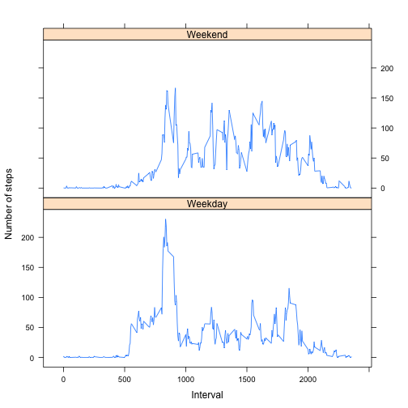

**What is mean total number of steps taken per day?**

For this part of the assignment, you can ignore the missing values in the dataset.

1 Calculate the total number of steps taken per day. 

step_sum_clean is the answer. 


```r
library(ggplot2)
#get the raw data and remove the NA from the data
raw<-read.csv("activity.csv")
raw_clean<-raw[!is.na(raw$steps), ]

#calcualte the total steps by each day
step_sum <- aggregate(x = raw[c("steps")],
                     FUN = sum,
                     by = list(Group.date = raw$date))
#clean the data, by remove the NA data
step_sum_clean<-step_sum[!is.na(step_sum$steps),]
head(step_sum_clean)
```

```
##   Group.date steps
## 2 2012-10-02   126
## 3 2012-10-03 11352
## 4 2012-10-04 12116
## 5 2012-10-05 13294
## 6 2012-10-06 15420
## 7 2012-10-07 11015
```

2 If you do not understand the difference between a histogram and a barplot, research the difference between them. Make a histogram of the total number of steps taken each day


```r
hist(step_sum_clean$steps, main="hist of daily steps", xlab="daily steps")
```

 

3 Calculate and report the mean and median of the total number of steps taken per day. 

step_mean_clean is the Mean and step_median_clean is the Median of the total number of steps taken by each day


```r
step_mean <- aggregate(x = raw[c("steps")],
                     FUN = mean,
                     by = list(Group.date = raw$date))
step_mean_clean<-step_mean[!is.na(step_mean$steps), ]
head(step_mean_clean)
```

```
##   Group.date    steps
## 2 2012-10-02  0.43750
## 3 2012-10-03 39.41667
## 4 2012-10-04 42.06944
## 5 2012-10-05 46.15972
## 6 2012-10-06 53.54167
## 7 2012-10-07 38.24653
```

```r
step_median<-aggregate(x = raw["steps"], 
                       FUN=median,
                       by=list(Group.date = raw$date))
step_median_clean<-step_median[!is.na(step_median$steps), ]
head(step_median_clean)
```

```
##   Group.date steps
## 2 2012-10-02     0
## 3 2012-10-03     0
## 4 2012-10-04     0
## 5 2012-10-05     0
## 6 2012-10-06     0
## 7 2012-10-07     0
```

**What is the average daily activity pattern?**

1 Make a time series plot (i.e. type = "l") of the 5-minute interval (x-axis) and the average number of steps taken, averaged across all days (y-axis). 

plot is as below. The blue line is the average number of steps taken, averaged across all days; 

```r
step_all_mean <- aggregate(x = raw_clean[c("steps")],
                     FUN = mean,
                     by = list(Group.int = raw_clean$interval))

plot(x=step_all_mean$Group.int, y=step_all_mean$steps, type="l", xlab="interval", ylab="mean steps over all days", col="blue")
```

 

2 Which 5-minute interval, on average across all the days in the dataset, contains the maximum number of steps?

max_5m_int below is the one contains the maximum number of steps. 

```r
max_5m_int<-step_all_mean[step_all_mean$steps==max(step_all_mean$steps), ]
max_5m_int
```

```
##     Group.int    steps
## 104       835 206.1698
```


**Imputing missing values**

1 Calculate and report the total number of missing values in the dataset (i.e. the total number of rows with NAs)

na_row, below, is the total number of missing values

```r
raw_na<-raw[is.na(raw), ]
na_row<-nrow(raw_na)
na_row
```

```
## [1] 2304
```

2 Devise a strategy for filling in all of the missing values in the dataset. The strategy does not need to be sophisticated. For example, you could use the mean/median for that day, or the mean for that 5-minute interval, etc.

Fill the NA data with the mean for that 5-minute interval.

3 Create a new dataset that is equal to the original dataset but with the missing data filled in.

following is the head of the new dataset


```r
raw_makeup<-raw
for ( i in 1:nrow(step_all_mean)) {
        raw_makeup[is.na(raw_makeup$steps)&raw_makeup$interval==step_all_mean[i, ]$Group.int, "steps"]=step_all_mean[i, ]$steps
  
}
head(raw_makeup)
```

```
##       steps       date interval
## 1 1.7169811 2012-10-01        0
## 2 0.3396226 2012-10-01        5
## 3 0.1320755 2012-10-01       10
## 4 0.1509434 2012-10-01       15
## 5 0.0754717 2012-10-01       20
## 6 2.0943396 2012-10-01       25
```


4 Make a histogram of the total number of steps taken each day and Calculate and report the mean and median total number of steps taken per day. Do these values differ from the estimates from the first part of the assignment? What is the impact of imputing missing data on the estimates of the total daily number of steps?

Yes, these values differ from the estimates from the first part of the assigment. 

The peak number is shift to right if imputing missing data on the estimates of the total or mean daily number of steps. 


```r
#calcualte the total steps by each day
step_sum_mk <- aggregate(x = raw_makeup[c("steps")],
                     FUN = sum,
                     by = list(Group.date = raw_makeup$date))

step_sum_clean$type<-"no_makeup"
step_sum_mk$type<-"makeup"
step_sum_combine<-rbind(step_sum_clean, step_sum_mk)
ggplot(step_sum_combine, aes(steps, fill=type))+geom_histogram(alpha=.5, aes(y=..density..),  position="identity")+ggtitle("histogram of total number of steps by each day")
```

 


```r
step_mean_mk<-aggregate(x=raw_makeup["steps"], 
                        FUN=mean,
                        by=list(Group.date=raw_makeup$date))

step_mean_mk$type<-"makeup"
step_mean_clean$type<-"no_makeup"
step_mean_combine<-rbind(step_mean_mk, step_mean_clean)

ggplot(step_mean_combine, aes(steps, fill = type)) + geom_histogram(alpha = 0.5, aes(y = ..density..), position = 'identity')+ggtitle("histogram of mean number of steps by each day")
```

 


```r
step_median_mk<-aggregate(x=raw_makeup["steps"], 
                         FUN=median,
                         by=list(Group.date=raw_makeup$date))

step_median_mk$type<-"makeup"
step_median_clean$type<-"no_makeup"
step_median_combine<-rbind(step_median_mk, step_median_clean)
ggplot(step_median_combine, aes(steps, fill=type))+geom_histogram(alpha=.5, aes(y=..density..), position="identity")+ggtitle("histogram of median number of steps by each day")
```

 

**Are there differences in activity patterns between weekdays and weekends?**

Yes, there is some difference between weekdays and weekends. The steps in weekdays have a peak around 800-900 intervals, and there is few steps in the other intervals. In the weekend, there are no peak steps, but during other intervals, the steps are more than in the weekdays. So, the rough conclusion is in the workday, the person's most activity is sitting; during the weekends, the person's activity is related with some walking activity. 


```r
raw_makeup_wd<-raw_makeup
raw_makeup_wd$date<-as.Date(raw_makeup_wd$date)
raw_makeup_wd$days<-weekdays(raw_makeup_wd$date)
raw_makeup_wd$wd<-NA
raw_makeup_wd[raw_makeup_wd$days=="Saturday" | raw_makeup_wd$days=="Sunday", ]$wd<-"Weekend"
raw_makeup_wd[is.na(raw_makeup_wd$wd), ]$wd<-"Weekday"
head(raw_makeup_wd[raw_makeup_wd$days=="Sunday", ])
```

```
##      steps       date interval   days      wd
## 1729     0 2012-10-07        0 Sunday Weekend
## 1730     0 2012-10-07        5 Sunday Weekend
## 1731     0 2012-10-07       10 Sunday Weekend
## 1732     0 2012-10-07       15 Sunday Weekend
## 1733     0 2012-10-07       20 Sunday Weekend
## 1734     0 2012-10-07       25 Sunday Weekend
```


```r
library(lattice)
step_mean_wd<-aggregate(raw_makeup_wd[c("steps")], FUN = mean, by=list(Group.int=raw_makeup_wd$interval, Group.wd=raw_makeup_wd$wd))
xyplot(steps~Group.int|Group.wd, data=step_mean_wd, type="l", layout=c(1, 2), ylab="Number of steps", xlab="Interval")
```

 
